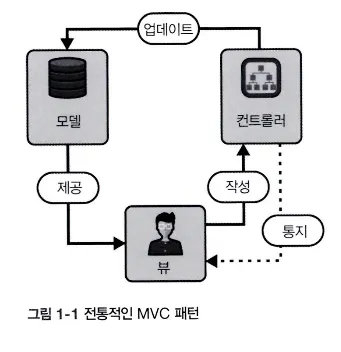
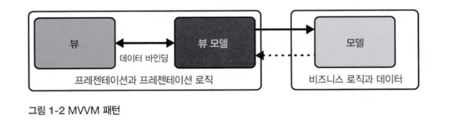
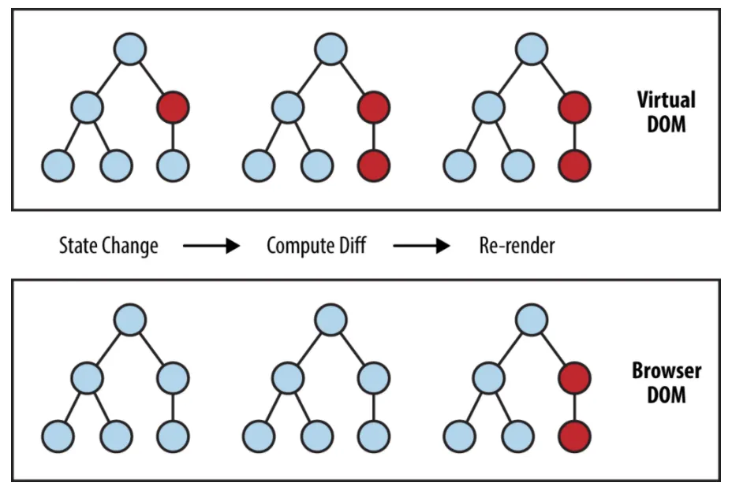
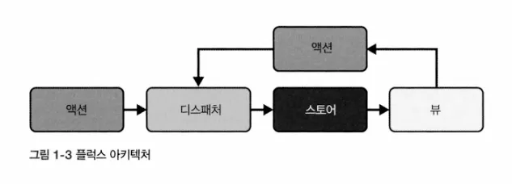

이 장에서는 리액트가 왜 존재하게 되었는지, 어떻게 동작하는지, 어떤 문제를 해결하려 작성되었는지 알아본다.

## 1.1 리액트는 왜 필요한가요?

웹 페이지에서의 즉각적인 업데이트를 위해서 아래의 세 가지 문제를 해결해야 했다

- 성능: 잦은 reflow의 성능 병목
- 신뢰성: 산재된 상태를 추적해 일관되게 유지하기 어려움
- 보안: 페이지에 삽입하는 HTML, JS를 모두 sanitize 해야함

## 1.2 리액트 이전의 세계

- 좋아요 버튼의 예시를 들 때, 리액트 이전의 방식은 코드가 방대하고 예측하기 어렵다.
- 작업량이 많고 확장성이 떨어져 추상화를 효과적으로 구현하기 위해 추가적인 도구가 필요하다.
- 이러한 페인 포인트를 해결하기 위한 JS 기반 솔루션이 등장하기 시작한다.

### 1.2.1 jQuery

jQuery는 자신이 제어하지 못하는 상태와 상호 작용하고 상태를 변경한다. 코드 어느 곳에서든 페이지 구조를 직접, 혹은 전역적으로 수정할 수 있기 때문이다.

이로 인해 상호 작용이 복잡해지고 동작 파악이 난해해진다. 이렇게 흩어진 DOM 조작은 코드를 유지하고 디버깅하기 어려워지게 만든다. (최신 프레임워크는 직접적인 DOM 조작 없이 UI를 업데이트하게 해준다)

또한, jQuery는 브라우저 환경에 크게 의존하여 테스트 환경 구축이 어렵다. 동작 격리가 어렵다.

이러한 여러 단점에도 불구하고 당시 DOM과 상호 작용하는 방식에 있어 혁신적이었다. 때문에 jQuery를 사용하되 예측 가능성과 재사용성을 보강한 라이브러리가 등장했다. 그중 하나가 Backbone이다.

### 1.2.2 Backbone

전통적 MVC 패턴을 자체 해석했다.



- 모델: 앱의 데이터와 비즈니스 규칙
- 뷰: 모델이 제공한 데이터를 표시하는 UI
- 컨트롤러: 모델과 뷰 사이의 인터페이스

MVC 패턴의 단점은? 리액트는 어떻게 해결했나

- 복잡한 UI를 관리할 때 방대한 컨트롤러 때문에 관리가 어렵다.
  - UI가 입력을 받고 출력하는 함수형 패러다임을 사용해 MVC 패턴을 단순화.
- 양방햔 데이터 바인딩으로 데이터 소유권과 관심사 분리가 힘들다.
  - “단방향 데이터 흐름”
- M, V, C가 강하게 결합됨
  - 컴포넌트 기반 모델로 모듈화

### 1.2.3 Knockout

최초의 반응형(관찰 가능한 방식으로 상태 변화에 따라 값을 업데이트 하는) JS 라이브러리이다.

MVC 패턴에서 진화한 MVVM (model-view-view model) 패턴을 사용한다.



간단히 말해서 위 MVC 패턴의 단점들을 어느정도 개선한 버전이다.

Knockout은 이 MVVM 패턴을 사용한 라이브러리인데, 보일러플레이트 코드가 많이 필요했다.

### 1.2.4 앵귤러JS

- 양방향 데이터 바인딩

양방향 데이터 바인딩을 사용한다. 오히려 UI와 디반 데이터의 상호 작용을 매우 단순화했다. (ex. 입력 폼에 이름을 입력하면 모델과 뷰가 동시에 업데이트됨)

- 모듈식 아키텍처

리액트 컴포넌트와 비슷하게 모듈식 아키텍처를 사용한다. 각 모듈을 루트 app에 의존성 주입하여 사용한다.

- 의존성 주입

DI는 객체가 의존성을 직접 만들지 않고 전달받는 패턴이다. 앵귤러 JS의 핵심 기능이기도 하다. 이 DI는 추후 export와 import로 빠르게 대체됨

# 1.3 리액트 등장

리액트는 단방향 데이터 흐름과 컴포넌트 기반 아키텍처를 제시했다.

### 1.3.1 리액트의 핵심 가치

- 선언적 코드와 명령형 코드
  - 리액트는 DOM에 대한 선언적 추상화를 제공한다.
  - 보고자 하는 것을 코드로 표현하는 방법을 제공하고, 실제로 어떻게 할지는 리액트의 몫이다.

```jsx
function MyList() {
	const [items, setitems] = useState(["I love"]);
	return (
		<div>
			<ul>
				{items.map((i) => (
					<li key={i /* 목록 항목을 고유하게 유지 */}>{i}</li>
				))}
			</ul>
			<NewItemForm onAddItem={(newItem) => setItems([...items, newltem])} />
		</div>
	)；
}
```

html처럼 보이는 코드를 작성한다. 엘리먼트를 참조할 때 클래스 이름도 필요가 없다.

컴포넌트의 역할은 UI에서 이 영역이 어떤 모습인지에 대한 설명 반환 뿐이다.

리액트는 업데이트 전의 DOM과 가상 DOM을 비교하고, 실제 DOM의 일부만 업데이트한다.

- 가상 DOM
  - 리액트는 가상 DOM으로 변경사항을 추적, 필요시 리렌더링한다.



- 컴포넌트 모델- 컴포넌트 모델은 리액트의 핵심적인 개념인데, 이유를 알아보자.
  - 쓸데 없는 반복을 줄인다.
  - 특정 컴포넌트를 반복 식별하고 시간에 따라 업데이트를 추적할 수 있다. (keying)
  - 관심사 분리와 UI와 그 UI에 해당하는 로직을 더 가깝게 배치할 수 있다 (응집도를 말하는듯) (composition)
- 불변 상태
  - 각 상태 업데이트는 독립된 스냅샷과 메모리 참조로 취급된다. 모든 상태 전환이 독립적이다.
  - 버그가 줄어들고, 예측 가능해진다.

### 1.3.2 리액트 출시

[React js The Documentary](https://www.youtube.com/watch?v=-qQkew3WHjM)

### 1.3.3 Flux

단방향 데이터 흐름을 강조해 더욱 예측 가능하게 만든다.



- 액션
  - 새 데이터와 액션의 종류를 식별하는 객체
  - 중심 디스패처를 통해 여러 스토어로 배포된다.
- 디스패처
  - 플럭스의 중심, 액션을 앱에 등록된 스토어로 배포한다.
  - 스토어는 디스패처에 스토어 자신과 콜백을 등록하여, 이 콜백 목록도 디스패처에서 관리
- 스토어
  - 앱의 상태와 로직을 포함. MVC의 모델과 다르게 다수의 객체 상태를 관리
  - 스토어 상태가 업데이트되면 변경 이벤트를 일으켜 뷰에 사항을 알린다.
- 뷰 - 리액트 컴포넌트

### 1.3.4 플럭스 아키텍처의 장점

- 단일 정보 출처 - 스토어에 단일 정보 출처가 저장되어 버그를 방지
- 테스트 - 각 부분을 독립적으로 테스트 가능
- 관심사 분리 - 모듈화되어 유지 보수가 쉬움

# 1.4 그래서… 리액트는 왜 필요한가요?

화면에 나타내고자 하는 바를 선언적으로 표현할 수 있게 한다.

tldr: 리액트를 쓰는 이유

- 컴포넌트 기반 아키텍처
- 선언적 모델
- 가상 DOM
- JSX
- 리액트 생태계
- 플랫폼을 타지 않는다는 점
- 메타의 지원

# 1.6 복습하기

1. 리액트를 만들게 된 동기: 방대한 사용자 상호작용이 필요한 환경에서의 여러 문제를 해결하기 위해
2. 리액트가 MVC와 MVVM보다 개선된 점은: 플럭스 패턴
3. 플럭스의 특징: 관심사 분리가 명확, 테스트가 용이, 단일 정보 출처
4. 선언적 프로그래밍 추상화의 장점: 가독성…? 코드를 이해하는데 필요한 비용이 적어짐
5. 가상 DOM의 역할: 실제 DOM에서 업데이트가 필요한 부분을 골라내어 그 부분만 업데이트 할 수 있게 해주는 역할을 한다.
